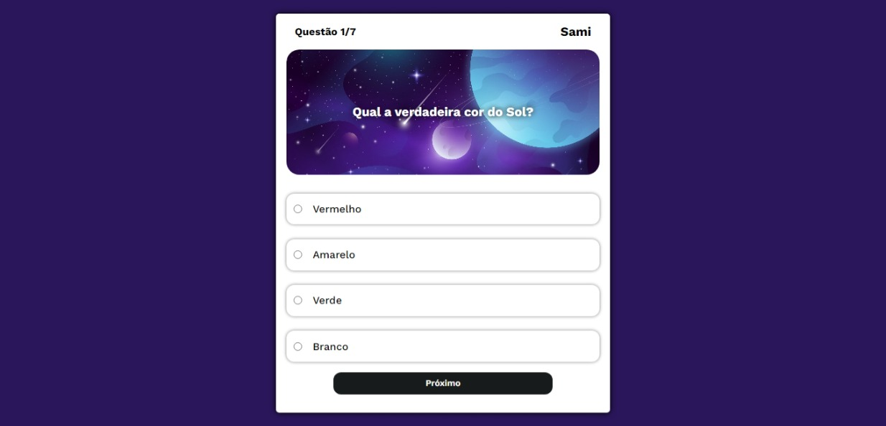

# Projeto Final módulo M1 - Quiz

## Sumário

  - [Descrição do projeto](#descricao-do-projeto)
  - [Screenshot](#screenshot)
  - [Links](#links)
  - [Feito com](#feito-com)
  - [Colaboradores](#colaboradores)

## Descrição do projeto

- Quiz de Astronomia feito com CSS, HTML e JavaScript.

### Screenshot

### Links

- Ilustração da tela inicial: [Storyset](https://storyset.com/)
- Projeto ao vivo: [Github pages](https://lucylima.github.io/projeto-m1-quiz)
- Google Fonts: [Google Fonts](https://www.fonts.google.com)
- Favicon: [Flaticon](https://www.flaticon.com/br/)

### Feito com

- HTML5 
- CSS3
- JavaScript

## Colaboradores

- Lucy Lima Santos - [Lucy Lima Santos](https://github.com/lucylima)
- Hewel Belmonte - [Hewel Belmonte](https://github.com/hewelbelmonte)
- Christian Júnior - [Christian Júnior](https://github.com/DelVecchioChris)
- Luiggi Miguel - [Luiggi Miguel](https://github.com/luiggimg)
- Samira Santos - [Samira Santos](https://github.com/samiicoding)